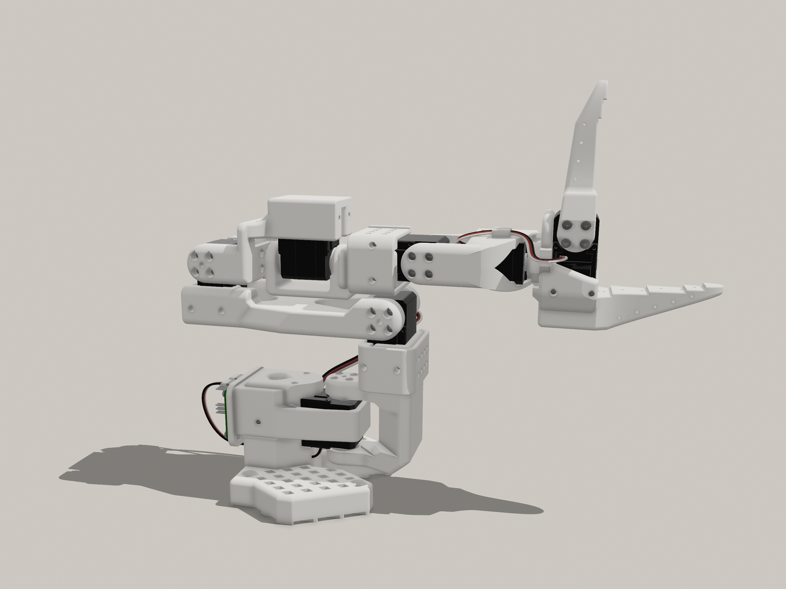
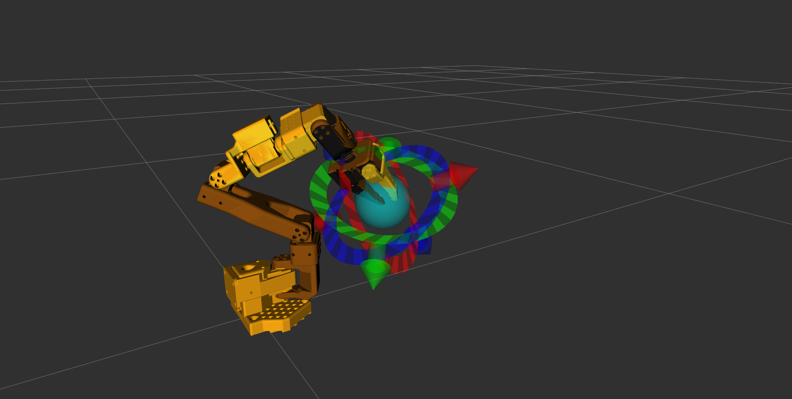

# SO101 ROS 2 — 6-DoF Workspace

[▶ Watch the real 6-DoF SO101 robot demo](Docs/Real_video.mp4?raw=true)

ROS 2 Jazzy workspace for a **6-DoF LeRobot SO-ARM101**: URDF, Gazebo Harmonic, ROS 2 Control, AND MoveIt 2.

The stock SO101 is 5-DoF. This repo adds **`elbow_rotate`** between the forearm (`lower_arm_link` / LINK4) and **`link5_link`**, so MoveIt can plan full 6-DoF Cartesian poses.





Feel free to create a branch named after a ROS distro to add support for other releases.

---

## What this repo is

This is the **description, planning, and launch stack** for the modified arm:

- 6-DoF URDF/Xacro (`so101_new_calib`) with LINK4 + link5 meshes
- Unified launch: Gazebo + MoveIt `move_group` + RViz in one command
- Real-robot launch with the same MoveIt config
- Calibration and controller YAML for the extra joint (servo ID 7)

The Feetech STS3215 driver used on the real arm lives in `so_arm_100_hardware`. Joint names, limits, and calibration for **this** 6-DoF robot are defined here, not in that package.

---

## Features

- **6-DoF kinematics**: `shoulder_pan`, `shoulder_lift`, `elbow_flex`, `elbow_rotate`, `wrist_flex`, `wrist_roll` (+ gripper)
- **MoveIt 2** (OMPL) on the `kinematics` planning group, with **Home** and **Extended** named states
- **Unified launch** for sim (`robot_mode:=sim`) or real (`robot_mode:=real`)
- **ROS 2 Control** for Gazebo and the real bus
- **RViz** Motion Planning with the interactive marker on `eef_frame_link`

---

## Prerequisites

- **ROS 2** (tested on **Jazzy**; Rolling/Kilted may work)
- **Gazebo Harmonic** (`ros_gz_*`)
- `colcon`, `rosdep`

---

## Clone and build

```bash
git clone --recurse-submodules git@github.com:dhruvilmahidhariya/so101_ros2.git
cd so101_ros2
source /opt/ros/jazzy/setup.bash
./setup.sh
source install/setup.bash
```

`setup.sh` runs `rosdep` and `colcon build --symlink-install`. Source `install/setup.bash` in every new terminal.

If you cloned without submodules, the real-robot driver is pulled with:

```bash
git submodule update --init --recursive
```

---

## 6-DoF kinematics

| Joint | Role | Motor ID |
|-------|------|----------|
| `shoulder_pan` | Base yaw | 1 |
| `shoulder_lift` | Shoulder pitch | 2 |
| `elbow_flex` | Elbow pitch | 3 |
| `elbow_rotate` | Forearm roll (added DoF) | 7 |
| `wrist_flex` | Wrist pitch | 4 |
| `wrist_roll` | Wrist roll | 5 |
| `gripper` | Jaw (own MoveIt group) | 6 |

Chain: `base_link` → `shoulder_link` → `upper_arm_link` → `lower_arm_link` → `link5_link` → `wrist_link` → `gripper_link` → `eef_frame_link`.

**Home** is all zeros and matches calibration `center.ticks: 2048` (URDF 0). That pose is a wrist singularity (`elbow_rotate` lines up with `wrist_roll` when `wrist_flex ≈ 0`). For Cartesian planning, start from the **Extended** named state.

Calibration: `src/lerobot_controller/config/calibration_so101_real.yaml`. Non-gripper joints map as `2048 + direction * radians * 4096 / 2π`.

---

## Usage

### Sim or real

```bash
# Gazebo + MoveIt + RViz (default)
ros2 launch lerobot_moveit so101.launch.py

# Real arm + MoveIt + RViz
ros2 launch lerobot_moveit so101.launch.py robot_mode:=real
```

Default serial port is `/dev/ttyACM0`. Override with `serial_port:=/dev/ttyUSB0` if needed.

In RViz use **Motion Planning** → **Execute** (OMPL). Planning group **kinematics** for the arm, **gripper** for the jaw. Named states: **Home**, **Extended**, **Gripper Open**, **Gripper Closed**.

**Real robot: no movement?**
- Set Planning Group to **kinematics**, move the marker, then Plan & Execute.
- A goal identical to the current pose reports “Goal reached” with no motion.
- Check `ls -l /dev/ttyACM0` and that your user is in `dialout`.

Start from **Extended**, not Home, to avoid the wrist singularity.

### Other launches

- RViz only: `ros2 launch lerobot_description so101_display.launch.py`
- Gazebo only: `ros2 launch lerobot_description so101_gazebo.launch.py` then `ros2 launch lerobot_controller so101_controller.launch.py`
- MoveIt only: `ros2 launch lerobot_moveit so101_moveit.launch.py`

---

## Packages

| Package | Role in this workspace |
|---------|------------------------|
| `lerobot_description` | URDF/Xacro, LINK4/link5 meshes, display and Gazebo launches |
| `lerobot_controller` | Controller YAML, 6-DoF calibration, real/sim controller launches |
| `lerobot_moveit` | MoveIt config, unified `so101.launch.py` |
| `so_arm_100_hardware` | STS3215 bus driver (dependency for `robot_mode:=real` only) |

---

## Credits

- **Modified 6-DoF link STLs** (LINK4 / link5, elbow-roll upgrade): [rabhishek100/so101-6dof-and-extended-versions](https://github.com/rabhishek100/so101-6dof-and-extended-versions).
- **ROS 2 workspace structure** (RViz, Gazebo, ros2_control, MoveIt): based on [Pavankv92/lerobot_ws](https://github.com/Pavankv92/lerobot_ws).
- **Real-robot STS3215 interface**: [brukg/so_arm_100_hardware](https://github.com/brukg/so_arm_100_hardware).

This repo adds the 6-DoF URDF, MoveIt group, calibration, and  unified launch integration on top of those.

---

## License

Apache-2.0 (see [LICENSE](LICENSE)). This project is based on RobotStudio SO-ARM100 and adheres to their license terms.
